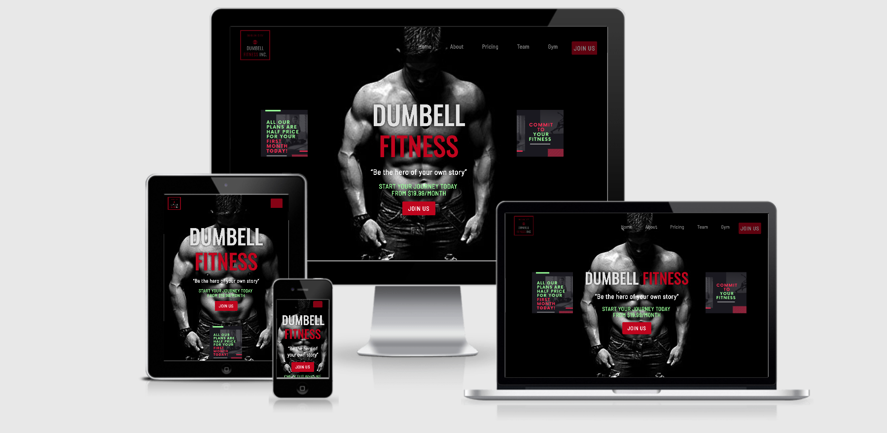
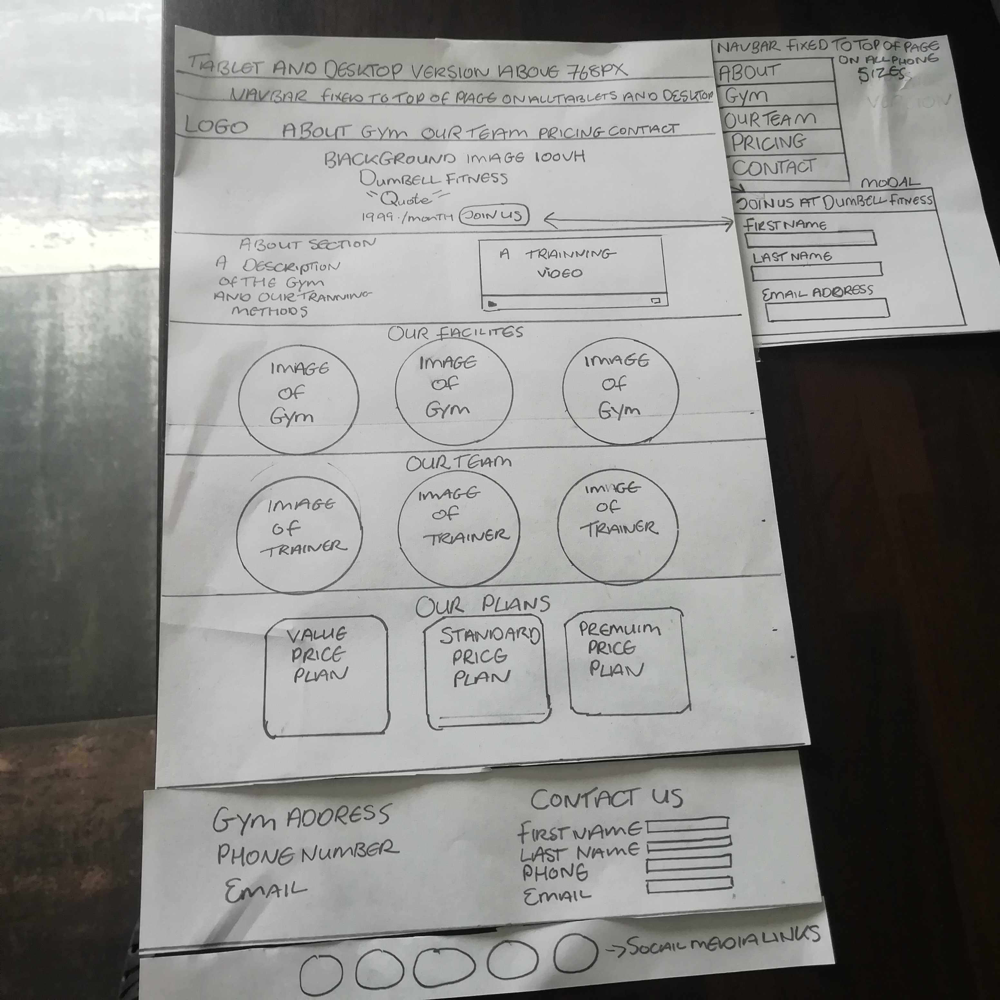
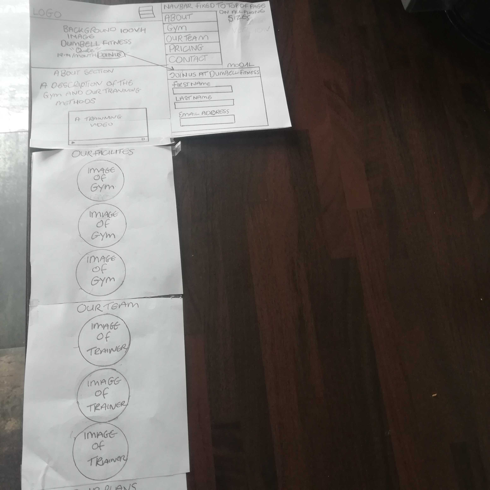
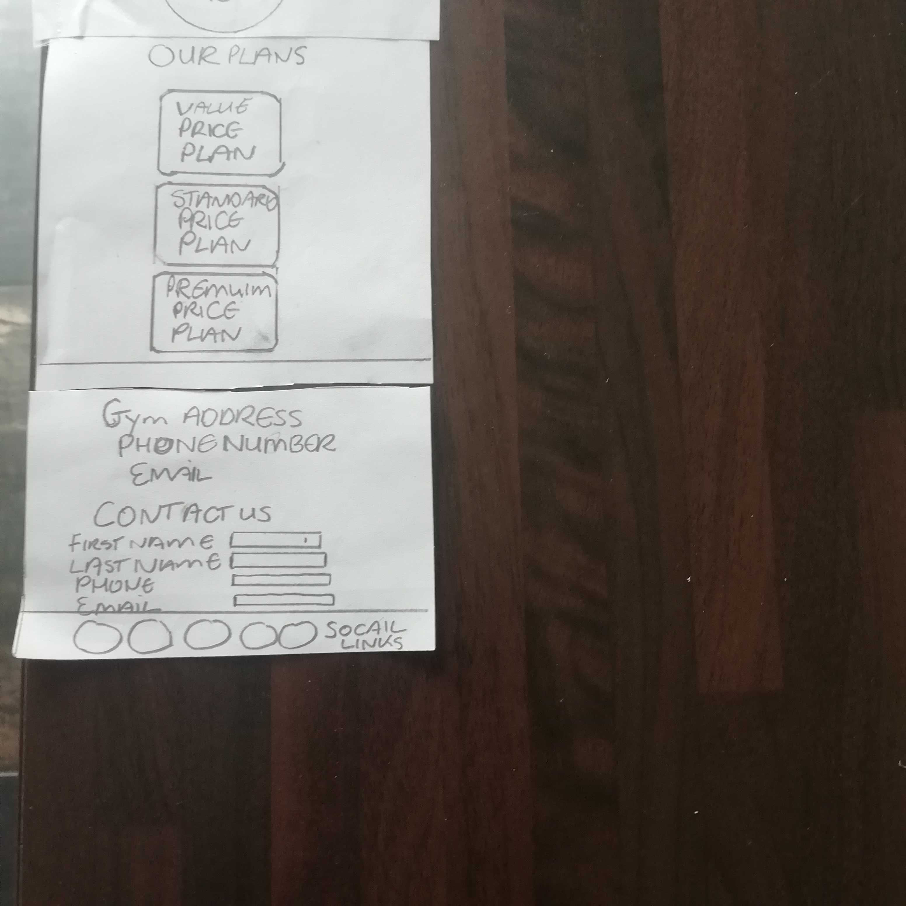

# Patrick Lynch  Dumbell-Fitness-Website

Milestone 
One Project: User-Centric Frontend Development - Code Institute

My Project is a website  for a gym. The website has five distinct sections. Each with a specific purpose. It's designed to be responsive on all devices.

## Demo
A live demo can be found [here](https://plyn85.github.io/First-Milestone-Project/).
___

# UX

The goal of the website was to grab the users attention and make them want to join the gym. With this in mind the color red was used throughout the website. Red is associated with lust, excitement, love, energy,
and movement. I complemented this with the color black and a dark grey. The color mint green was used mainly for financial Information. Green is associated with growth, health, nature, wealth, money, calmness, masculinity, generosity, fertility, envy, good luck, peace, harmony, support, and energy.
The fonts used where copied and pasted from google fonts. Oswald was used for headings a Barlow semi condensed was used for smaller text.
For potential customers I wanted to provide them with an eye catching view of everything Dumbell Fitness has to offer. 

### Client stories
1. As a new visitor to this website, I want to be able to navigate my way around the sight easily.
2. As a new visitor to this website, I want to able to see what the gym has to offer. There facilities,pricing, trainers etc.
3. As a returning visitor, I want to see has the gym any new offers available, new training methods or updated Its facilities since I last visited the sight.
4. As a returning visitor, I want to submit a general question to the gym through the modal.  

### Wireframe mockups:
  <table>
   <tr>
    <td>Above 768px  </td>
    <td>Below 768px  </td>
     <td>Below 768px  </td>
    </tr>
</table>

# Features

### Navbar
The navbar is contained at the top of the page and has the gyms logo and five links to the rest of the page, plus a join up 
button which when pressed brings to the user to a modal.
 The navbar Is fixed to the top of the page  over lapping the callout Image  with opacity see trough effect also added. This allows the user to see trough the navigation bar as they scroll 
which Is especially useful on a mobile device so the user can use the dropdown menu navigation links to navigate the page will still being able to see trough the navigation bar to the website in the background.

### Callout
 The purpose of this section is to grab the customers attention providing them with the gym name,some pricing details and join us button.
Throughout the website there are several opportunities to access the modal through a join up button.
 I felt as the main goal of the website was to attract customers to join up it was important to give them 
 multiple opportunities. This section also has a background Image which is set to cover the entire view height of the screen.Finally there is a jumbotron added which contains the gyms name an Inspirational quote, details of our cheapest joining price an another button with a chance to join up.

 ### About
The about section  provides users with a description of the gym and Images of some of
 the different fitness programs it contains. 
 The goal here is to give the user a brief description of the gym an what its all about.
 
 ### Pricing
   The pricing section gives the user
   a chance to see the gyms prices. A further join up button is contained at the bottom of each
   pricing section. The goal here is to entice customers to join. A darker green Is used  here for the button to make It easier to focus on.
   
 ### Our Team
  The  our team section which Introduces the user
 to  the gyms trainers and provides a bio outlining each trainers experience. Each Trainer 
   Is on a card which spins around when hovered over or touched on mobile.
    Which reveals a bio about each trainer on the back. The purpose here is to Introduce each trainer in a friendly but professional manner. 
   
  ### Gym
 This is followed by a gym section which has 3 subsections, which provide examples of training methods, 
 via Images of videos linked to a modal with each video.
  The goal here is to provide the user with a view of the type of training the gym provides. Next the gyms facilities are shown with a gallery of rooms which changes to a modal carousel when an image is clicked. The results section has  an example of what a customer could hope to achieve upon joining the gym am taking part in a 12 week program.

### Social Links 
Social link where added to the back of the trainer cards, the training section modals and the footer all link to relevant social media accounts.  

## Existing Features
- Navigation bar- Allows the user to easily navigate the website sections.
- CTA button- allows to user to quickly contact the gym in order to make enquiry about joining. They are located on the navbar,
  in the callout section and in both the pricing section an the 
  footer.
- Modal- all join up  buttons are connected to a modal which asks for the user name, phone number and email address. There is also a text box with an opportunity for the user to ask a question. All contain the required attribute an the user will be Informed if the fail to fill out any of the required boxes.   
- Social Icons- They are located In the footer, on the the video modal and on the back of the Trainer cards. At the moment they  are not linked to any social media accounts. They currently have target="about_blank" so the user would be a guided to a a separate page when the social media accounts are added. As outlined below It is something I would like to change In the future.
- Our Teams-allows user to view trainers an there backgrounds.
- Training Videos-allows user to view training methods via a video modal. 
- Gallery- allows user to view the different rooms the gym contains.
- Customer Testimonials- allows user to view a customers 12 week transformation using one of the gyms provided programs. 

## Features to Implement In the future

- Smooth scrolling effect on all browsers- In the future I  would like to add a JavaScript that makes the 
   smooth scrolling effect work across all browsers.
- Add JavaScript to- In the future I would like to remove the JavaScript  from the html teams section file an add a JavaScript Function to a separate js file which is best practice.
- Add JavaScript- In the future I would like to add a JavaScript scroll spy plugin to change the color of the navigation  links as the user scrolls over each section to which It Is already  linked 
- TimeTable Section-In the future I would I would like to add a timetable section to the website outlining the times of different classes and what days and times they are on.

## Technologies
___
-  Vs code - I used vs code as my editor for building this website.
-  HTML 
-  CSS
-  Bootstrap - to make the website responsive and used for layout.
-  FontAwesome - to provide icons for the website.
- Google fonts - used to supply the fonts for this website.
- jQuery - was used for the navbar pricing, and video sections. 
- LightBox - Lightbox was used  In the galleries section a subsection of the gym section. 
- canva - canva was used by me to make many of the different Images found on the website.This the allowed me to keep many of the Images Inline with the over color scheme chosen for the website.

## Testing 
  I used WSC CSS Validation and HTML Markup Validation to validate the code. 
    The only Issue to arise was in the our team section of the HTML file
     where an (Error: Attribute ontouchstart not allowed on element div 
    at this point. was contained) which Is considered bad practice.
     I researched the subject and found this could be
     corrected using JavaScript In a  JavaScript  file but as It beyond 
    my capability at this point in the course 
    I would leave in the HTML file as felt it was an Important part of the our team section.
 ### Client testing stories
  1. As a new visitor to this website, I want to be able to navigate my way around the sight easily.
     - All the navigation links bring me to the expected sections of the page.
     - When I click on any the join up buttons contained trough out the website, the option to contact the gym.
 2. As a new visitor to this website, I want to able to see
     what the gym has to offer.There facilities,pricing, trainers etc. 
     - All the sections of the page are clearly 
     defined an I can clearly see the gyms pricing structure, 
    the different trainers and there experience level.
     I can also see the different facilities the gym offers, there
    training methods and what these training methods 
    might achieve in one of there 12 week programs.     
 3. As a returning visitor, I want to see has the gym any new offers available, new training methods or
    updated Its facilities since I last visited the sight.
    - I can clearly see the gym has not updated Its pricing structure or
     Its offers to new members since I last visited the website.
 4. As a returning visitor,  I want to submit a general question to the gym through the modal.
    - I was able to easily access the websites modal through the join button contained
     on the navbar where I submitted a question I had regarding the gym.

   ## Manual testing of all elements on website
All sections of the website where tested through out the project using chrome dev tools on all device sizes. When It was near completion 
    I begin to test on many different browsers some of which Include Firefox,Edge,Opera,Safari an Internet explorer. The website was then sent to family an friends to gather 
    feedback on the look an functionality of the website on many different devices. 
    
   1.  CTA button- This was tested on navbar, callout section, pricing section and
       footer to make sure all buttons linked to the modal correctly. 
   2.  Navigation bar- Tested that all navigation links bring you to the correct part of the website.
     Continually tested navbar logo, main header an links through the building of this website. Constant 
     alterations where made to make the navbar items suited to all devices. This was done mainly
    trough the use of my own media queries to adjust sizes for the different devices. 
    The navbar was also tested so that it  collapses In the correct place. 
  
   2. Callout section - This section was tested on all devices throughout the building of the website. 
    A number of different background Images where tested as I wanted to find something that fit the overall look of the website.
   The jumbotron text was adjusted many times trough 
    media queries for the different devices. No Images where displayed on smaller devices, one Image was displayed for ipads
     and two for laptops and desktops. For this feature bootstraps grid system was used. The background Image wont remain fixed when viewed on a chrome browser on android.
      As it does not effect the overall flow of the website and I could not find a solution to the bug I decided to leave It in. After deploying the website to git hub and seeing it on an mobile phone for 
      the first time trough landscape mode on mobile, I discovered that the call out section contents  and the  navbar  In with the website where much too big In this mode 
      an pushing down on to the about section making everything look terrible. I wrote some media queries and made adjustments. Adjustments where also made through media queries for small tablets in landscape mode.
  
  3. About section- The about sections responsiveness was tested on all devices. Both bootstrap an media queries where used.
      Bootstrap was used to show or block Images on different devices. 
      Media queries where used to change the size of text an headers.
 
   4. Pricing section- This section was originally taken and altered from a tutorial a link will be provided In the credit section below. The tutorial had built In responsiveness which was tested on all devices. Some adjustments where needed after text was added to make all cards the same length.
       This was done via media queries. 
  
   5. Our team section- This section was  originally taken and altered from a tutorial a link will be provided In the credit section below. 
       The tutorial had built In responsiveness which was tested on all devices. Adjustments where made using the bootstrap grid system to give the cards a better 
       look on different device sizes. The our team section contains a background Image which was checked on the dev tools across all devices.
        But when checked on an on android mobile phone on the chrome browser there was an Issue with the size of the Image.
        I considered about removing the Image for mobile but after visiting stack overflow I found that a bug may be causing the
         Issue which only effects android on the chrome browser. I tried a a few work arounds from stack over flow but had no success. I 
         then checked on every other browser and every other device where the Image displayed 
         fine. This confirmed that the bug was the most likely cause so I decided to leave the 
         Image with I view to to finding a workable solution at the some stage In the future.
 
   6. Gym section-The gym section contains 3 subsections. 
   - The training section-This section was  originally taken and altered from a tutorial a link will be provided In the credit section below. It was tested across all devices using the dev tools. 
      Small alterations where made using the bootstrap grid to give the cards a better appearance.
   - The facilities- This section This section was  originally taken and altered from a tutorial a link will be provided In the credit section below. It was tested across all devices an was found to to be 
      fully functional across all devices an browsers changes where not needed.   
   - The results-This section was originally taken and altered from a tutorial a link will be provided In the credit section below
      This was tested across all browsers and devices with no Issues found.
  
   8. The footer- This section This section was  originally taken and altered from a tutorial a link will be provided In the credit section below.
     This was tested across all browsers an adjusted accordingly.A Bug was found In both  the address and copyright 
    sections located in the footer. In which the col class from bootstrap was causing the text to condense. 
    The Issue was resolved by adding  -ms-flex: none; In to the effected class In the style.css.   
  9. All social media links where tested to see if the access the relevant accounts. All brought me to the accounts provided.
      

## Deployment 
The site is hosted on GithHub Pages at [https://plyn85.github.io/First-Milestone-Project/](https://plyn85.github.io/First-Milestone-Project/) and is built from the master branch. The Master
branch was created in the repository by:

  1. On GitHub, navigate to your GitHub Pages site's repository.
  2. Under your repository name, click  Settings.
  3. Use the Select source drop-down menu to select master as your GitHub Pages publishing source.
  4. Click Save

Should you wish to clone this:

   1. On GitHub, navigate to the main page of the repository.
   2. Under the repository name, click Clone or download.
   3. In the Clone with HTTPs section, click the copy icon to copy the clone URL for the repository.
   4. Open terminal.
   5. Change the current working directory to the location where you want the cloned directory to be made.
   6. Type git clone, and then paste`[https://plyn85.github.io/First-Milestone-Project/](https://plyn85.github.io/First-Milestone-Project/)
   7. Press Enter. Your local clone will be created.

## Credits

### Content
   All text on the website was written by myself. 

### Media
Some of the Images where taken from google Images. 
    Other  Images and the gym logo where Designed by myself using [ https://www.canva.com/](https://www.canva.com/)
    Ressources that where also used for Images where [https://unsplash.com/](https://unsplash.com/) and  [https://pixabay.com/.](https://pixabay.com/.)
    All videos in the trainning section of the website where taken from  [https://www.youtube.com/](https://www.youtube.com/)

### Acknowledgements

  - The code for the navigation bar was originally taken 
   and  many modifications where made from a tutorial found at [https://startbootstrap.com/snippets/full-image-header/](https://startbootstrap.com/snippets/full-image-header/)
  - The code for the callout section was originally taken 
    and  many modifications where made from a tutorial found at[ https://plyn85.github.io/First-bootstrap-website/](https://plyn85.github.io/First-bootstrap-website/) 
   - The code for the pricing section was originally taken 
     and  many modifications where made from a tutorial found at [https://startbootstrap.com/snippets/pricing-table/](https://startbootstrap.com/snippets/pricing-table/)
   - The code for the our gym subsection-videos section was originally taken 
     and  many modifications where made from a tutorial found at [https://mdbootstrap.com/plugins/jquery/gallery/]([https://mdbootstrap.com/plugins/jquery/gallery/)
   - The code for the  gym subsection-gallery section was originally taken 
     and  many modifications where made from a tutorial found at  [ athttps://bootsnipp.com/snippets/ZXyEz]([athttps://bootsnipp.com/snippets/ZXyEz)
   - The code for the  gym subsection-customer testimonials section was originally taken  
     and  many modifications where made from a tutorial found at  [https://mdbootstrap.com/docs/jquery/sections/testimonials/](https://mdbootstrap.com/docs/jquery/sections/testimonials/) 
   - The code for the  gym subsection-customer testimonials section was originally taken  
     and  many modifications where made from a tutorial found at  [https://colorlib.com/wp/bootstrap-footer/](https://colorlib.com/wp/bootstrap-footer/) 

   Inspiration for this website was taken from [https://athleanx.com/](https://athleanx.com/)

#### Disclaimer

   The content of this Website is for educational purposes only.

